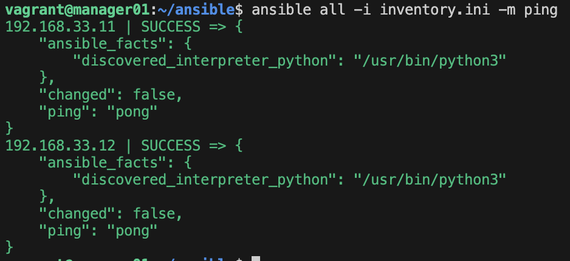
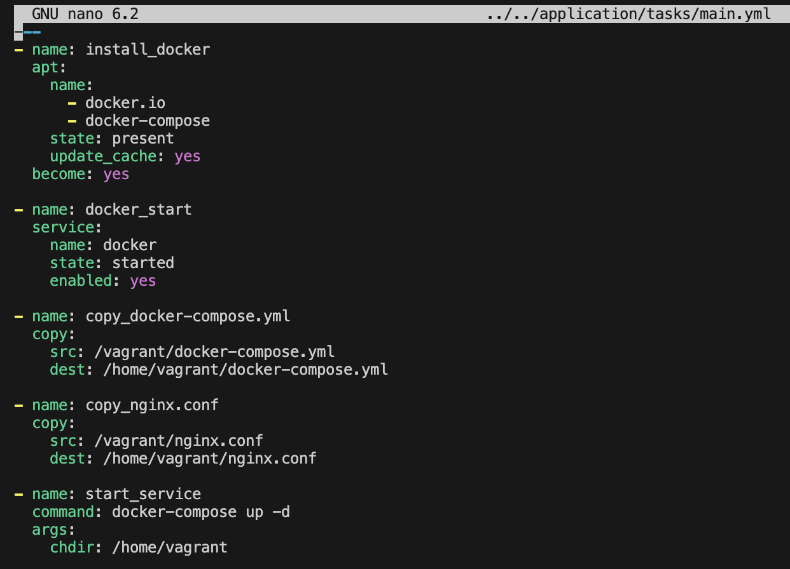

## Part 1. Удаленное конфигурирование узла через Ansible

1.Создаем три ВМ `manager01` и `node01/02` с помощью vagrant  
- Пишем `Vagrantfile` без инструкций `provision` с прокидыванием портов с `node01` на `хост-машину`  

- Поднимаем машины при помощи `vagrant up`  

2.Готовим `manager` как рабочую станцию для удаленного конфигурирования  
- Заходим на `manager01` по `ssh` и пробуем уже с него подключиться по `ssh` к `node01`  

Нет прав доступа

- Генерируем `ssh-ключ` без `passphrase`  

- Прокидываем ключ на обе ноды `node01/02` вручную путем копирования ключа  

- Снова пробуем подключиться с `manager01` к `node01`  

Успешно

- Копируем на `manager01` docker-compose.yml и nginx.conf с предыдущего проекта, а микросервис в прошлом проекте мы уже упаковали в контейнеры и запушили в docker hub, так что будем брать оттуда  

- Накатим `ansible` на `manager01` и создадим соответствующую папку, в которой создаем inventory-файл  

-  Прописываем в `inventory.ini` машины-серверы, к которым будем обращаться  

- Пингуем машины через `ansible`  

3.Пишем первый плейбук для Ansible, который выполняет: apt update, устанавливает docker, docker-compose, копирует compose-файл из manager'а и разворачивает микросервисное приложение  

- Дальше запускаем на `ansible` заданный `playbook.yml`  

4.Прогоняем тесты через `postman`  

5.Формируем роли  
- Создавать роли будем автоматически, поэтому сначала инициируем  

- Прописываем для каждой роли `tasks/main.yml`  

application: 

apache: 

postgres: 

- Теперь прописываем отдельный `playbook_roles.yml` для запуска по ролям  
 

- Далее запуск плейбука  

- Тесты `postman` для микросервиса на `node01`  

- Проверка доступности `apache` и `postgres` на `node02`  

## Part 2. Service Discovery

1.Пишем конфиги для `consul`  
- `consul_server.hcl`  

- `consul_client.hcl`  

2.Создаем четыре машины - `consul_server, api, manager и db` с прокидыванием соответствующих портов  
- `vagrantfile`  

Далее так же, [как в предыдущем задании](#p1.1), прокидываем ключи с `manager` на остальные ВМ и накатываем `ansible` на `manager`

3.Пишем плейбуки и инициируем роли  
- Напишем плейбук для запуска ролей  

- Собственно, инициация  
 

- Теперь описываем конкретные роли и что они включают   
3.1.`install_consul_server`  
- Плейбук  
  

- Проверяем, что машины отображаются в консуле во вкладке `nodes`  

3.2.`install_consul_client`  
- Плейбук

- Далее регистрируем нашу БД и сам сервис в консуле, как `sidecar proxy`, для того, чтобы не обращаться к БД напрямую

  

- Накатываем `envoy` по отдельности на `api` и `db`, создавая его как два разных `systemd unit`  

- Проверяем, что наши сервисы отобразились в консуле во вкладке `services`  

3.3.`install_db`  
- Плейбук  

3.4.`install_hotels_service`  
- Плейбук    
  
- Накатываем сервис, как `systemd unit`, прокидывая заданные переменные окружения  

4.Проверяем работоспособность CRUD-операций над сервисом отелей, делая запросы  
- Создаем отель  
  
и проверяем что добавился отель  

- Смотрим все отели  
  